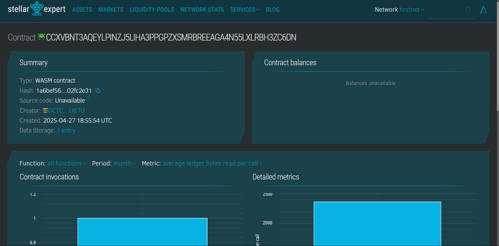

# 🧘‍♀️ CorporateWellnessPrograms Smart Contract

---

## 📘 Project Description

The **CorporateWellnessPrograms** smart contract is designed to manage and track employee participation in wellness activities within an organization. Built using the Soroban SDK for the Stellar blockchain, this contract brings transparency, accountability, and data integrity to corporate wellness initiatives by storing participation records and wellness points on-chain.

---

## 🌟 Project Vision

To empower organizations to build a healthier and more engaged workforce by providing a decentralized, verifiable, and transparent platform for managing corporate wellness activities.

---

## Contract Address Details:

CCXVBNT3AQEYLPINZJ5LIHA3PPGPZXSMRBREEAGA4N55LXLRBH3ZC6DN

## 🚀 Key Features

- ✅ **Register Wellness Activity**  
  Employees can register their participation in wellness activities (e.g., yoga, gym, meditation).

- 📊 **Track Wellness Points**  
  Points are awarded based on activity type and can be tracked through the smart contract.

- 🔍 **View Participation**  
  Employees and admins can query participation history using a unique employee ID.

- 🏆 **Reward Eligibility Check**  
  Admins can check if an employee qualifies for wellness rewards based on accumulated points.

---

## 🔮 Future Scope

- 🎁 **On-chain Incentives & Rewards**  
  Automate reward distribution using tokens based on participation.

- 📱 **Frontend Integration**  
  Build a mobile/web app interface for real-time participation tracking.

- 🧑‍💼 **Manager Dashboards**  
  Visualize participation data and track wellness trends across departments.

- 🤝 **Multi-Org Support**  
  Enable multi-tenancy for multiple organizations on a single contract.

---

💡 *Built with Soroban SDK — bringing real-world impact to blockchain technology!*
